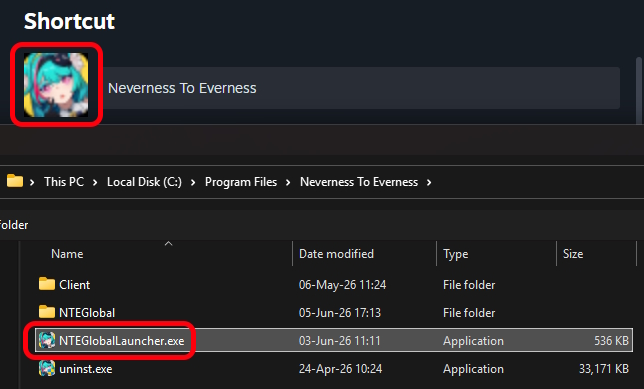
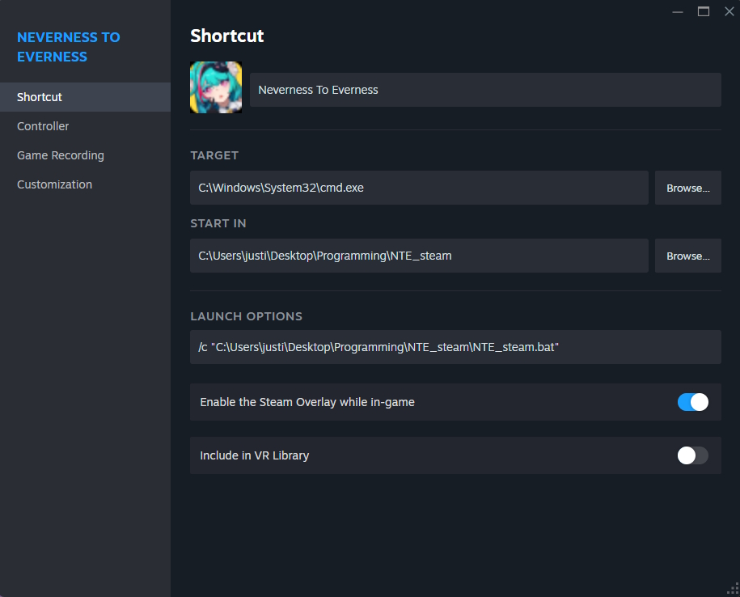
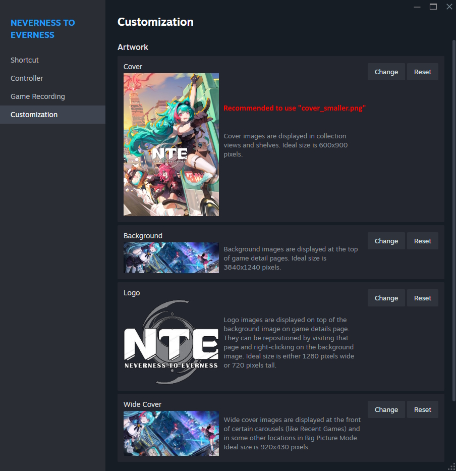
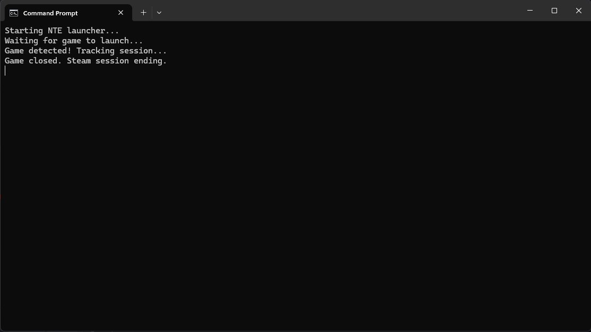
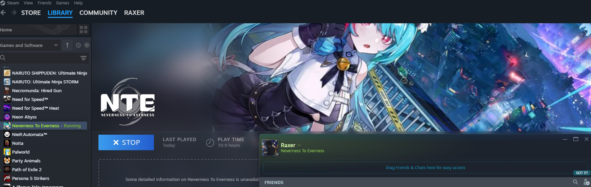

# NTE on Steam

## Info

NTE (Neverness to Everness) is not yet on steam as of when I made this, and because of the nature of this game (opening a launcher before letting u open the game) steam won't track that the game was launched and just stops showing u as being "in-game", but I wanted steam to show when I'm playing it, so I made a .bat file to detect when the game is running, and steam opens this .bat rather then the actual game.

The .bat is simple and it just checks for if the game is running, writes a simple console line as an indicator, and automatically closes itself when the game is closed.

[cover_smaller.png](NTE_STEAM/cover_smaller.png) should be used as the cover on steam so that the downscaling doesn't make the final result pixelated.

and for the small icon at the sidebar, just point to the actual `game.exe` or `gamelauncher.exe` and it can grab the original icon. 

## How to use

if your game is installed normaly on the C: drive - `C:\Program Files\Neverness To Everness\...` 
then the `.bat` file should work without needing any changes, otherwise, edit the `.bat` file to point to whatever location u have **NTE** installed at. 

"Add a non-steam game" 
TARGET: `C:\Windows\System32\cmd.exe` 
START IN: `C:\point\to\folder\where\the\.bat\is\in` 
LAUNCH OPTIONS: `/c "C:\point\to\folder\where\the\.bat\is\in\NTE_steam.bat"` 
everything else is up to you. 
 

 

